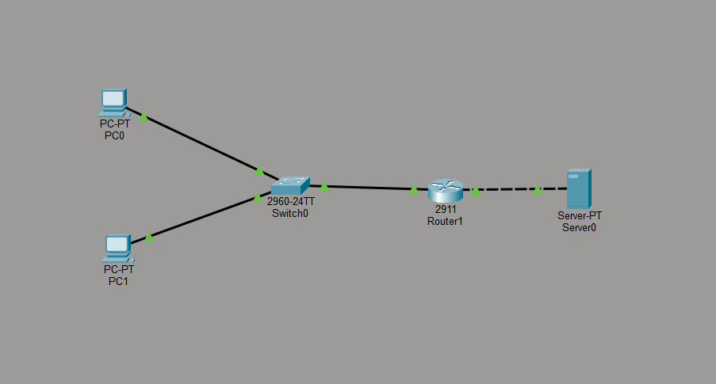
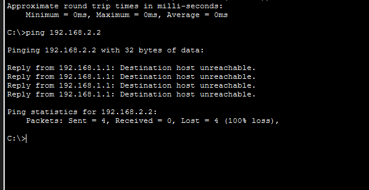
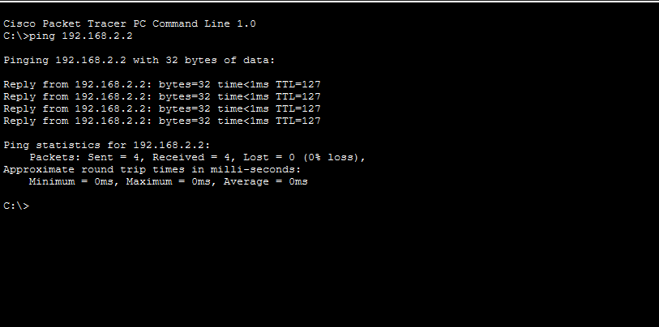

<<<<<<< HEAD
#  Basic Firewall Simulation using Cisco Packet Tracer

##  Overview
This project demonstrates a basic firewall implementation using Access Control Lists (ACLs) in Cisco Packet Tracer.  
The network is segmented into two subnets, and traffic filtering is applied to control access between them.

---

## ⚙️ Features
- Network segmentation using subnets
- Implementation of ACL-based firewall rules
- Controlled communication between devices
- Simulation of allowed and blocked traffic scenarios

---

## 🌐 Network Architecture
- **HR Network:** 192.168.1.0/24  
- **Server Network:** 192.168.2.0/24  

### Devices Used:
- 2 PCs (Client systems)
- 1 Switch (2960)
- 1 Router (2911)
- 1 Server

---

## 🛡️ Firewall Configuration (ACL)
- **Allowed:** PC0 (192.168.1.2) can access the server  
- **Blocked:** PC1 (192.168.1.3) is restricted from accessing the server  

ACL is applied on the router to filter outgoing traffic towards the server network.

---

## 🧪 Testing & Results
- Successful ping from authorized device (PC0 → Server)  
- Blocked ping from unauthorized device (PC1 → Server)  

This confirms correct implementation of firewall rules.

---

## 🛠️ Tools Used
- Cisco Packet Tracer

---

## 📸 Screenshots

### 🔹 Network Topology

### 🔹 Allowed Traffic (PC0 → Server)

### 🔹 Blocked Traffic (PC1 → Server)

---

## Key Learnings
- Understanding of subnetting and network segmentation  
- Practical implementation of Access Control Lists (ACLs)  
- Traffic flow direction (inbound vs outbound filtering)  
- Basic firewall concepts in networking  

---

##  Future Improvements
- Add NAT (Network Address Translation)  
- Implement multiple ACL rules for different services  
- Simulate larger enterprise network  
=======
# Firewall-Simulation---Cisco-Packet-Tracer
A Cisco Packet Tracer project demonstrating network segmentation and firewall implementation using Access Control Lists (ACLs) to control traffic between subnets.
>>>>>>> c2c2dcb86665061c9a08b887b84a5d568e98d3fb
